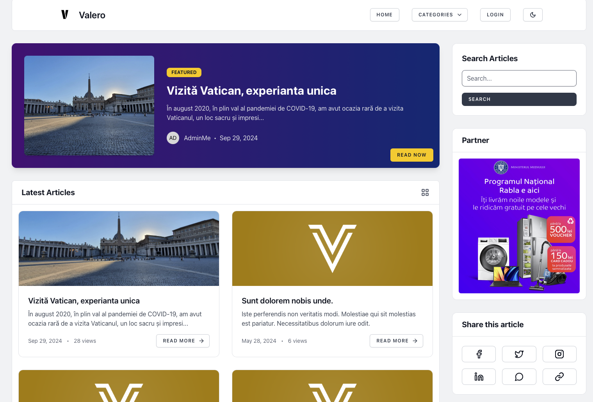

# Valero - Blogging Platform

Valero is an open-source article-sharing platform built with **Laravel 10** and **Livewire**. It allows users to create, edit, and share blog-style articles with features such as categories, images, and galleries. The admin interface includes full CRUD operations for managing articles, categories, and a modal-based category creation interface.


## 📦 Features

- **Article Management**: Create, edit, schedule, and publish articles with image uploads and galleries.
- **Category Management**: Dynamically create and manage categories via a Livewire-powered modal.
- **Admin Panel**: Full CRUD operations for managing articles, categories, and users with a clean and responsive interface.
- **Livewire Integration**: Dynamic, real-time components for a seamless user experience.
- **Tailwind CSS**: Modern and responsive design with utility-first CSS framework.
- **Minimalistic UI**: Clean and intuitive interface for both admin and public users.
- **SEO Optimization**: Integrated with the **RalphJSmit/Laravel/SEO** package for enhanced search engine visibility.
- **Dark Mode Support**: Toggle between light and dark themes for user comfort.
- **Reading Time Estimation**: Displays estimated reading time for articles.
- **View Count**: Tracks and displays the number of views for each article.
- **Responsive Design**: Optimized for all screen sizes, ensuring a consistent experience across devices.


More screenshots in the [valero_kit/screenshots](valero_kit/screenshots) folder.

---

## 🚀 Installation

Follow these steps to set up the project locally:

### 1. Clone the Repository

```bash
git clone https://github.com/your-repository/valero.git
cd valero
```

### 2. Install Dependencies

```bash
composer install
npm install
```

### 3. Set Up Environment Variables

Create a `.env` file by copying `.env.example`:

```bash
cp .env.example .env
```

Update the `.env` file with your database credentials and other environment-specific values (like `APP_NAME`).

### 4. Generate Application Key

```bash
php artisan key:generate
```

### 5. Publish SEO Package Configuration and Migrations

```bash
php artisan vendor:publish --provider="RalphJSmit\Laravel\SEO\SEOServiceProvider"
```

### 6. Run Migrations

```bash
php artisan migrate
```

### 7. Create Storage Link

Ensure that the storage is linked to serve uploaded images:

```bash
php artisan storage:link
```

### 8. Seed the Database (Optional)

For demo purposes, seed the database with sample data:

```bash
php artisan db:seed
php artisan db:seed --class=ArticleSeeder
```

### 9. Compile Front-End Assets

For development:

```bash
npm run dev
```

For production:

```bash
npm run build
```

### 10. Run the Application

Start the local development server:

```bash
php artisan serve
```

Visit [http://localhost:8000](http://localhost:8000) in your browser to access Valero.

---

## 🗂 Application Structure

The application follows the standard **Laravel** structure with a focus on component-based architecture using **Livewire**.

### Key Components:

- **Article Management**: Articles can be created, edited, scheduled, and published, with options for adding featured images and gallery images.
- **Category Management**: Categories can be dynamically created via a Livewire modal and are used to organize articles.
- **Admin Panel**: The admin interface allows full CRUD operations on articles and categories, with optimized UI for usability and a modern look.

### Blade Components and Layouts:

- `resources/views/layouts/admin.blade.php`: The main layout used in the admin panel for managing articles, categories, and users.
- `resources/views/livewire/create-category-modal.blade.php`: A Livewire-powered modal for creating categories.

### Routes:

Key routes for the application are defined in `routes/web.php`. Some important routes include:

- `/admin/articles`: CRUD routes for managing articles.
- `/admin/categories`: CRUD routes for managing categories.
- `/admin/articles/{article}/images/{image}`: Route for deleting images from an article's gallery.
- `/articles/{article}`: Public route for viewing an article.
- `/categories/{category}`: Public route for viewing articles in a category.

### Livewire Components:

1. **`CreateCategoryModal`**:
   - A dynamic modal for creating categories.
   - Triggered by emitting Livewire events from other Blade files.
   - Provides real-time feedback and form validation.

### Example Routes

- **Admin Articles Routes:**
  - `GET /admin/articles`: List of all articles.
  - `GET /admin/articles/create`: Form for creating a new article.
  - `POST /admin/articles`: Store a new article.
  - `GET /admin/articles/{id}/edit`: Edit an article.
  - `PUT /admin/articles/{id}`: Update an article.
  - `DELETE /admin/articles/{id}`: Delete an article.

- **Category Routes:**
  - `GET /admin/categories`: List of all categories.
  - `POST /admin/categories`: Store a new category via modal or form.

### Article Model

The `Article` model represents a blog article and includes the following relationships:

- `category`: Belongs to a category.
- `images`: Has many images.
- `tags`: Belongs to many tags.

### SEO Implementation

The project uses the **RalphJSmit/Laravel/SEO** package to handle SEO-related functionality. This package provides features such as:

- Automatic generation of meta tags based on article data.
- Social media previews for articles.
- Sitemap generation.

---

## 🎨 UI and UX Enhancements

The UI follows a **minimalist design** with modern, interactive elements using **Tailwind CSS**. Hover effects, shadows, and transitions have been applied to buttons and table rows for a clean and intuitive user experience.

- Buttons have hover effects and smooth transitions.
- Form elements are styled for clarity and ease of use.
- Tables in the admin panel have subtle row hover effects, making it easier to manage content.
- Dark mode support for a more comfortable reading experience in low-light conditions.

---

## 🔮 Future Enhancements

- **User Authentication and Roles**: Further define roles (admin, editor, user) and manage access permissions.
- **SEO Enhancements**: Improve the existing SEO functionality by adding more meta tags and optimizing social media previews.
- **Article Search**: Add a search functionality to find articles based on title or content.
- **Dashboard Statistics**: Implement more detailed statistics on articles and categories in the admin dashboard.

---

## 🎨 Design

- **Logo font**: Protest Guerrilla.
- **Icons**: Lucide. https://lucide.dev/icons/

---

## 🤝 Contributing

Contributions are welcome! Please fork the repository and submit a pull request.

---

## 📝 License

This project is open-source and licensed under the [MIT license](LICENSE).

---

### ❤️ Thanks for checking out **Valero**! Happy coding!
